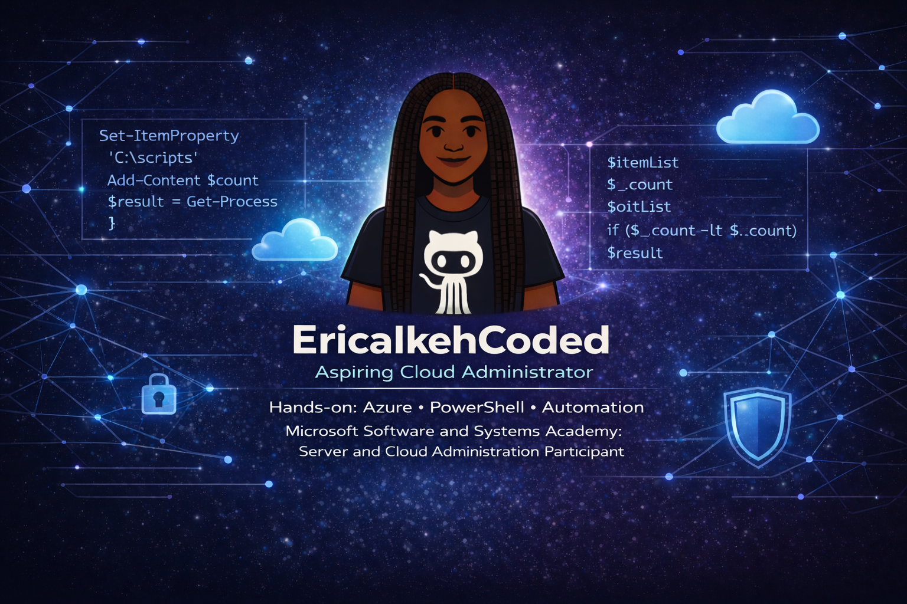

<!-- Banner Image -->

  

# Hi, I'm Erica Ikeh 👋🏽

## About Me

🏛️ Cloud and systems administrator with 7+ years of federal program experience — now building hands-on expertise in **Azure, PowerShell automation, and Windows Server administration** through Microsoft's Software & Systems Academy (MSSA).

🌱 Bridging public sector experience with modern cloud infrastructure

---

## 🛠️ Tech Stack

---

## 🎓 Certifications & Training

- **CompTIA Security+ (SY0-701)** — *In progress, expected 2026*
- **Microsoft Azure Fundamentals (AZ-900)** — *In progress, expected June 2026*
- **Microsoft Software & Systems Academy (MSSA)** — *Server & Cloud Administration, June 2026*

---

## 📂 Featured Project

### 🖥️ [WinOps Automation Suite](https://github.com/EricaIkehCoded/WinOps-Automation-Suite)

A PowerShell automation toolkit built as part of the AZ-040T00 curriculum. Demonstrates hands-on proficiency across 9 skill areas including cmdlets, pipeline, WMI/CIM, remoting, Azure, and M365.

---

## 📊 Currently Working On

- ✅ Phase 1 — Local Admin & Cmdlets
- ✅ Phase 2 — Pipeline Tools
- ✅ Phase 3 — PSProviders & PSDrives
- ✅ Phase 4 — WMI & CIM
- ✅ Phase 5 — Scripting
- 🔄 Phase 6 — Remoting *(in progress)*
- ⏳ Phase 7 — Azure Management
- ⏳ Phase 8 — M365 Management
- ⏳ Phase 9 — Background & Scheduled Jobs

---

## 🤝 Connect With Me

---

📬 **Open to opportunities** in Systems Administration, Cloud Infrastructure, and IT Security. Let's connect.
